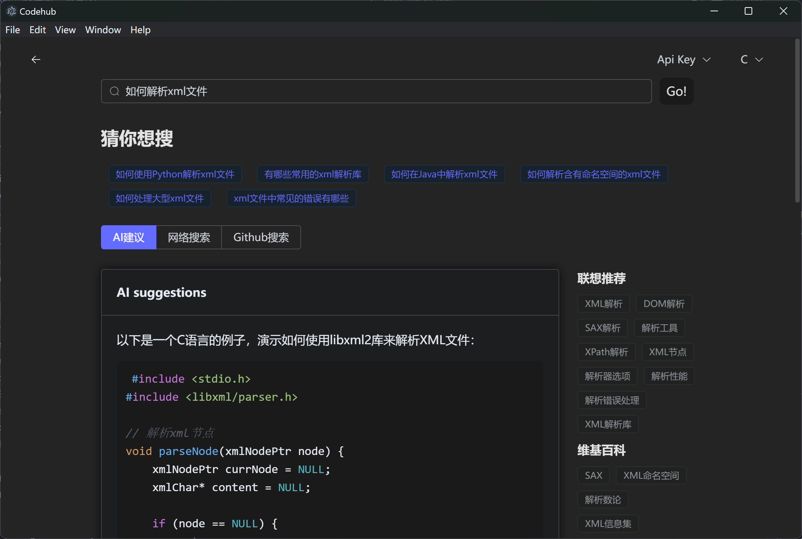
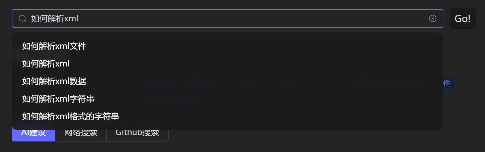
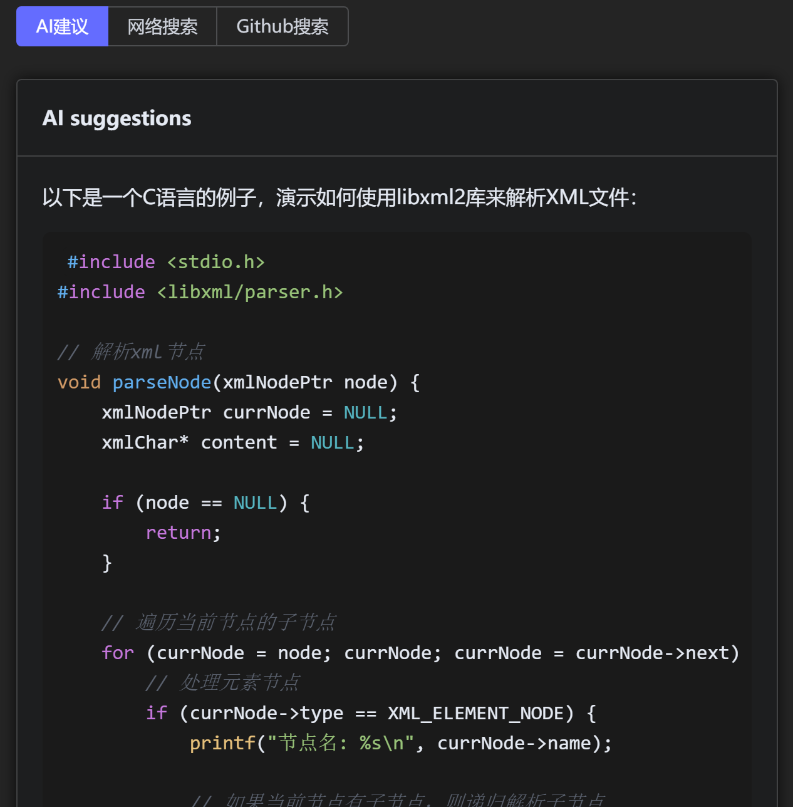
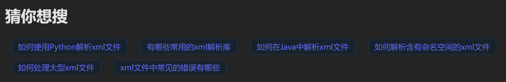
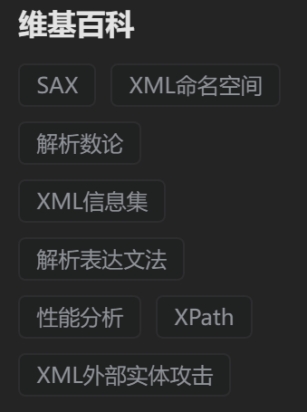
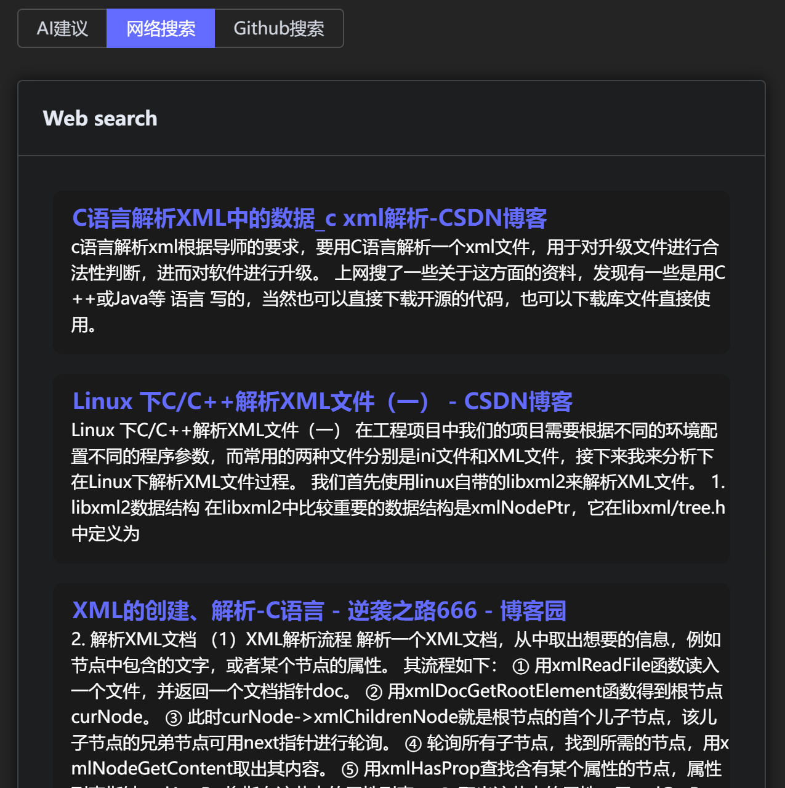
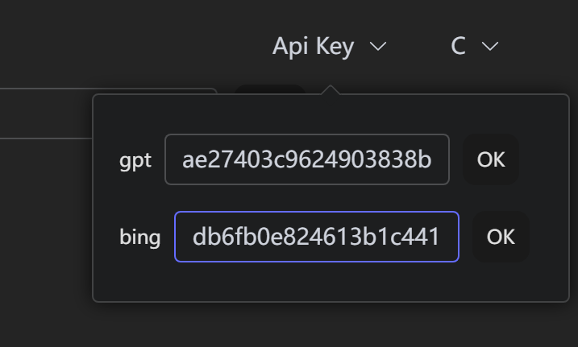

# Codehub应用文档

[toc]

## Codehub简介

`Codehub`是一款跨平台帮助编程初学者学习代码的软件，他集成了`Ai`，`Web搜索`，`github`,`wikipedia`以及`Stackoverflow`等多方面的信息来源来帮助初学者给出相应的代码样例与相关教程。

- 主要界面

  

## 应用架构

`Codehub`采用`electron`与`Vue`实现，`electron`是一个基于`nodejs`的跨平台桌面应用开发框架，他可以让我们使用`html`,`css`,`js`,`Vue.js`等前端技术来开发桌面应用。`Vue`是一个轻量级的前端框架，他可以让我们更加方便的开发前端应用。

## 应用功能

`Codehub`的主要功能有：问题搜索，Ai代码建议，问题联想，关键词联想，Wiki百科介绍，Web搜索，github仓库搜索，Stackoverflow文章推荐。

- **问题搜索**

  用户可以在搜索框中键入想要了解的编程问题，同时搜索框会给出问题建议，帮助用户更快捷的搜索。

  

- **Ai代码建议**

  用户可以得到来自Ai对于所搜索问题的相关建议与回答，一般包含若干个代码示例，与相应的代码解释。

  

- **问题联想**

  用户输入问题后，软件会根据用户所输入的问题进行问题联想，给用户更多的搜索建议

  

- **关键词联想**

  用户输入问题后，软件会根据用户所输入的问题进行关键词提取与联想，给出解决用户问题中可能会需要用到的一些关键知识点，点击对应关键词会直接在浏览器中对该关键词进行搜索。

  

- **Wiki百科介绍**

  Wiki百科介绍会根据用户的问题，直接给出可能用到的知识的百科链接，点击后会直接进入到百科页面。

  

- **Web搜索**

  软件会根据用户输入的问题直接在网络上进行相关搜索，给出相应的链接，点击后会跳转到对应的链接页面。

  

- **github仓库搜索**

  软件还会根据用户的问题，在github的仓库中搜索相关内容，点击链接后会跳转到对应的仓库界面。

  

- **Stackoverflow文章推荐**

  进入软件界面，软件会随机推荐Stackoverflow上的热点问题，并列出其问题涉及的相关方面，点击问题界面后，会进入到问题详情。

  

## 功能实现

### 界面实现

界面使用`Vue`实现，主要使用了`element-plus`组件库与`tailwind css`，`element-plus`组件库提供了美观的组件，`tailwind css`提供了使用原子类来代替传统`css`的开发，通过这些技术，可以方便快捷地开发出美观的界面。以下是部分界面代码：

```vue
<script setup lang="ts">
import{Ref} from 'vue'
defineProps({
    questions: {
        type: Array<String>,
        required: true
    },
})

const emit = defineEmits(['select'])
const handleSelect = (ques: string) => {
    emit('select', ques)
}
</script>

<template>
    <div class="flex flex-col w-full justify-center items-center mb-2">
        <div class="w-full flex justify-start items-center flex-wrap">
            <el-tag v-for="(ques,index) in questions" :key="index" class="mx-2.5 my-1" @click="handleSelect(ques.toString())">{{ ques }}</el-tag>
        </div>
    </div>
</template>

<style scoped>
.el-tag {
    cursor: pointer;
}
</style>
```

### API调用

`Codehub`总共使用了来自[gpt]([Overview - OpenAI API](https://platform.openai.com/overview))，[bing]([Quickstart: Perform a search with Python - Bing Web Search API - Bing Search Services | Microsoft Learn](https://learn.microsoft.com/en-us/bing/search-apis/bing-web-search/quickstarts/rest/python))，[github]([GitHub REST API 文档 - GitHub 文档](https://docs.github.com/zh/rest?apiVersion=2022-11-28))，[mediawiki]([API:REST API - MediaWiki](https://www.mediawiki.org/wiki/API:REST_API/zh))，[StackExchange]([Stack Exchange API](https://api.stackexchange.com/docs/))五个来源的api，各个api的调用实现如下：

#### gpt

##### 正常传输

- `json schema`

  ```json
  {
      "id": "chatcmpl-8CPEoTKCVzwF0tZ2d0O8izSNQZfXP",
      "object": "chat.completion",
      "created": 1697967642,
      "model": "gpt-3.5-turbo-0613",
      "choices": [
          {
              "index": 0,
              "message": {
                  "role": "assistant",
                  "content": "{如何定义一个函数？}\n\n{什么是递归函数？如何实现递归函数？}\n\n{什么是面向对象编程？如何定义一个类？}\n\n{如何判断两个变量是否相等？}\n\n{如何调试代码？有哪些常用的调试方法？}\n\n{什么是异常处理？如何在代码中进行异常处理？}"
              },
              "finish_reason": "stop"
          }
      ],
      "usage": {
          "prompt_tokens": 57,
          "completion_tokens": 99,
          "total_tokens": 156
      },
      "code": 0,
      "msg": "ok"
  }
  ```

- `代码示例`

  ```javascript
  import axios from 'axios'
    
  export const getGptResponse = (params:any,key:string) => {
      return axios({
          method:'post',
          url:'http://flag.smarttrot.com/index.php/api/v1/chat/completions',
          data:params,
          headers:{
              'Content-Type':'application/json',
              'Authorization':'Bearer '+key
          }
      }).then(res=>{
          if(res.status===200&&res.data){
              if(res.data.msg==='ok'){
                  if(res.data.choices[0].finish_reason==='stop'&&res.data.choices[0].message){
                      return res.data.choices[0].message.content
                  }
              }else{
                  return 'api error '+res.data.msg
              }
          }else{
              return 'network error'
          }
        }
      )
  }
  ```

##### 流式传输

由于gpt生成完整回答的时间过长，用户使用体验并不好，因此api还提供了流式传输的选项，可以实现gpt一边生成，一边传给客户端响应。使用流式传输需要在调用参数中指定`stream: true`选项，接口会将结果作为EventStream的一系列事件（event）返回,例如：

```javascript
async fetch(messages: GptMsgs) {
    return await fetch('http://flag.smarttrot.com/index.php/api/v1/chat/completions', {
      method: 'POST',
      body: JSON.stringify({
        model: 'gpt-3.5-turbo',
        messages,
        stream: true
      }),
      headers: {
        'Content-Type': 'application/json',
        Authorization: `Bearer ${this.key}`
      }
    })
  }
```

同时发起请求后，需要从response中通过`getReader`方法获取`reader`，同时通过通过while循环 + `reader.read()`获取每次传输的数据，每次获取的数据格式为`Uint8Array`，通过浏览器原生支持的`TextDecoder`将buffer解析成字符串，再通过正则表达式匹配其中的`json`数据

```javascript
const parsePack = (str: string) => {
    // 定义正则表达式匹配模式
    const pattern = /data:\s*({.*?})\s*\n/g
    // 定义一个数组来存储所有匹 配到的 JSON 对象
    const result = []
    // 使用正则表达式匹配完整的 JSON 对象并解析它们
    let match
    while ((match = pattern.exec(str)) !== null) {
        const jsonStr = match[1]
        try {
        const json = JSON.parse(jsonStr)
        result.push(json)
        } catch (e) {
        console.log(e)
        }
    }
    // 输出所有解析出的 JSON 对象
    return result
}
```

最后获得gpt的回答。

```javascript
async stream(prompt: string, history: GptMsgs = []) {
    let finish = false
    let count = 0
    // 触发onStart
    this.onStart(prompt)
    // 发起请求
    const res = await this.fetch([...history, { 'role': 'user', content: prompt }])
    if (!res.body) return
    // 从response中获取reader
    const reader = res.body.getReader()
    const decoder: TextDecoder = new TextDecoder()
    // 循环读取内容
    while (!finish) {
      const { done, value } = await reader.read()
      // console.log(value)
      if (done) {
        finish = true
        this.onDone()
        break
      }
      count++
      const jsonArray = parsePack(decoder.decode(value))
      if (count === 1) {
        this.onCreated()
      }
      jsonArray.forEach((json: any) => {
        if (!json.choices || json.choices.length === 0) {
          return
        }
        const text = json.choices[0].delta.content
        this.onPatch(text)
      })
    }
  }
```

#### bing

##### web search

通过直接使用bing的`web search` api，得到有关网页的内容，并排列表示出来

- `json schema`

  ```json
  {
      "_type": "SearchResponse",
      "queryContext": {
          "originalQuery": "如何定义一个函数？ C"
      },
      "webPages": {
          "webSearchUrl": "https:\/\/www.bing.com\/search?q=%E5%A6%82%E4%BD%95%E5%AE%9A%E4%B9%89%E4%B8%80%E4%B8%AA%E5%87%BD%E6%95%B0%EF%BC%9F+C",
          "totalEstimatedMatches": 56500000,
          "value": [
              {
                  "id": "https:\/\/api.bing.microsoft.com\/api\/v7\/#WebPages.0",
                  "name": "C语言函数定义（C语言自定义函数） - C语言中文网",
                  "url": "http:\/\/c.biancheng.net\/view\/1851.html",
                  "isFamilyFriendly": true,
                  "displayUrl": "c.biancheng.net\/view\/1851.html",
                  "snippet": "C语言函数定义（C语言自定义函数）. 函数是一段可以重复使用的代码，用来独立地完成某个功能，它可以接收用户传递的数据，也可以不接收。. 接收用户数据的函数在定义时要指明参数，不接收用户数据的不需要指明，根据这一点可以将函数分为有参函数和无 ...",
                  "deepLinks": [
                      {
                          "name": "C语言枚举类型",
                          "url": "http:\/\/c.biancheng.net\/view\/2034.html",
                          "snippet": "C语言枚举类型（C语言enum用法）详解 在实际编程中，有些数据的取值往往是有限的，只能是非常少量的整数，并且最好为每个值都取一个名字，以方便在后续代码中使用，比如一个星期只有七天，一年只有十二个月，一个班每周有六门课程等。",
                          "deepLinks": []
                      },
                      {
                          "name": "什么是函数",
                          "url": "http:\/\/c.biancheng.net\/view\/1850.html",
                          "snippet": "C语言自带的函数称为 库函数（Library Function）。库（Library） 是编程中的一个基本概念，可以简单地认为它是一系列函数的集合，在磁盘上往往是一个文件夹。C语言自带的库称为 标准库（Standard Library），其他公司或个人开发的库称为 第三方库（Third。",
                          "deepLinks": []
                      },
                      {
                          "name": "函数声明以及函数原型",
                          "url": "http:\/\/c.biancheng.net\/view\/1857.html",
                          "snippet": "学完《C语言多文件编程》，你对C语言的认识将会有质的提升，瞬间豁然开朗，轻松超越 90% 的C语言程序员。 函数参考手册 最后再补充一点，函数原型给出了使用该函数的所有细节，当我们不知道如何使用某个函数时，需要查找的是它的原型，而不是它的定义，我们往往不关心它的实现。",
                          "deepLinks": []
                      },
                      {
                          "name": "带实例演示",
                          "url": "http:\/\/c.biancheng.net\/view\/1861.html",
                          "snippet": "C语言递归函数（递归调用）详解[带实例演示] 一个函数在它的函数体内调用它自身称为 递归调用 ，这种函数称为 递归函数 。 执行递归函数将反复调用其自身，每调用一次就进入新的一层，当最内层的函数执行完毕后，再一层一层地由里到外退出。",
                          "deepLinks": []
                      },
                      {
                          "name": "指针",
                          "url": "http:\/\/c.biancheng.net\/c\/80\/",
                          "snippet": "C语言指针是什么？1分钟彻底理解C语言指针的概念 2. C语言指针变量的定义和使用（精华） 3. C语言指针变量的运算（加法、减法和比较运算） 4. C语言数组指针（指向数组的指针）详解 5. C语言字符串指针（指向字符串的指针）详解 6. C语言数组灵活多变的"
                      },
                      {
                          "name": "循环结构和选择结构",
                          "url": "http:\/\/c.biancheng.net\/c\/32\/",
                          "snippet": "C语言顺序结构就是让程序按照从头到尾的顺序依次执行每一条C语言代码，不重复执行任何代码，也不跳过任何代码。 C语言选择结构也称分支结构，就是让程序“拐弯”，有选择性的执行代码；换句话说，可以跳过没用的代码，只执行有用的代码。",
                          "deepLinks": []
                      }
                  ],
                  "dateLastCrawled": "2023-10-16T04:59:00.0000000Z",
                  "language": "zh_chs",
                  "isNavigational": true
              },
              {
                  "id": "https:\/\/api.bing.microsoft.com\/api\/v7\/#WebPages.2",
                  "name": "C语言基础：函数的声明与定义 - 知乎 - 知乎专栏",
                  "url": "https:\/\/zhuanlan.zhihu.com\/p\/33885407",
                  "isFamilyFriendly": true,
                  "displayUrl": "https:\/\/zhuanlan.zhihu.com\/p\/33885407",
                  "snippet": "函数的声明就是告诉编译器我们想要定义一个函数，并明确规定其返回值（输出）、函数名、参数表（输入）。. 声明函数的语法如下：. type function_name (type var); 下面我们来看几个声明函数的例子：. int max (int a, int b); \/\/返回两个变量中值较大的值。. float sum (float ...",
                  "dateLastCrawled": "2023-10-19T19:35:00.0000000Z",
                  "language": "zh_chs",
                  "isNavigational": false
              },
              {
                  "id": "https:\/\/api.bing.microsoft.com\/api\/v7\/#WebPages.3",
                  "name": "C语言函数的定义 - C语言教程 - C语言网",
                  "url": "https:\/\/www.dotcpp.com\/course\/25",
                  "isFamilyFriendly": true,
                  "displayUrl": "https:\/\/www.dotcpp.com\/course\/25",
                  "snippet": "C语言函数的定义. C源程序是由 函数 组成的。. 最简单的程序有一个主函数main ()，但实用程序往往由多个函数组成，由主函数调用其他函数，其他函数也可以互相调用。. 函数 是C源程序的基本模块，程序的许多功能是通过对函数模块的调用来实现的，学会编写和 ...",
                  "dateLastCrawled": "2023-10-20T06:24:00.0000000Z",
                  "language": "zh_chs",
                  "isNavigational": false
              },
              {
                  "id": "https:\/\/api.bing.microsoft.com\/api\/v7\/#WebPages.4",
                  "name": "C语言函数详解（包括声明、定义、使用等）",
                  "url": "http:\/\/c.biancheng.net\/c\/71\/",
                  "isFamilyFriendly": true,
                  "displayUrl": "c.biancheng.net\/c\/71",
                  "snippet": "C语言函数的概念 2. C语言函数定义（C语言自定义函数） 3. C语言形参和实参的区别（非常详细） 4. C语言return的用法详解，C语言函数返回值详解 5. C语言函数调用详解（从中发现程序运行的秘密） 6. C语言函数声明以及函数原型 7. C语言全局变量和局部变量（带 ...",
                  "dateLastCrawled": "2023-10-16T10:21:00.0000000Z",
                  "language": "zh_chs",
                  "isNavigational": false
              },
              {
                  "id": "https:\/\/api.bing.microsoft.com\/api\/v7\/#WebPages.5",
                  "name": "C 语言函数详解 - 知乎",
                  "url": "https:\/\/zhuanlan.zhihu.com\/p\/610310388",
                  "isFamilyFriendly": true,
                  "displayUrl": "https:\/\/zhuanlan.zhihu.com\/p\/610310388",
                  "snippet": "C 语言函数详解. 函数是 C 语言中的重要组成部分，它可以将程序分解为模块，提高代码的可读性和可维护性。. 函数由函数头和函数体组成，函数头包括函数名、返回值类型和参数列表，函数体包括函数执行的语句块。. 本文将详细介绍 C 语言中的函数，包括 ...",
                  "dateLastCrawled": "2023-10-17T15:59:00.0000000Z",
                  "language": "zh_chs",
                  "isNavigational": false
              }
          ]
      },
      "relatedSearches": {
          "id": "https:\/\/api.bing.microsoft.com\/api\/v7\/#RelatedSearches",
          "value": [
              {
                  "text": "c 定义一个函数指针",
                  "displayText": "c 定义一个函数指针",
                  "webSearchUrl": "https:\/\/www.bing.com\/search?q=c+%E5%AE%9A%E4%B9%89%E4%B8%80%E4%B8%AA%E5%87%BD%E6%95%B0%E6%8C%87%E9%92%88"
              },
              {
                  "text": "c语言怎么自定义一个函数",
                  "displayText": "c语言怎么自定义一个函数",
                  "webSearchUrl": "https:\/\/www.bing.com\/search?q=c%E8%AF%AD%E8%A8%80%E6%80%8E%E4%B9%88%E8%87%AA%E5%AE%9A%E4%B9%89%E4%B8%80%E4%B8%AA%E5%87%BD%E6%95%B0"
              },
              {
                  "text": "c语言自定义输入函数",
                  "displayText": "c语言自定义输入函数",
                  "webSearchUrl": "https:\/\/www.bing.com\/search?q=c%E8%AF%AD%E8%A8%80%E8%87%AA%E5%AE%9A%E4%B9%89%E8%BE%93%E5%85%A5%E5%87%BD%E6%95%B0"
              },
          ]
      },
      "rankingResponse": {
          "mainline": {
              "items": [
                  {
                      "answerType": "WebPages",
                      "resultIndex": 0,
                      "value": {
                          "id": "https:\/\/api.bing.microsoft.com\/api\/v7\/#WebPages.0"
                      }
                  },
                  {
                      "answerType": "WebPages",
                      "resultIndex": 1,
                      "value": {
                          "id": "https:\/\/api.bing.microsoft.com\/api\/v7\/#WebPages.1"
                      }
                  },
                  {
                      "answerType": "WebPages",
                      "resultIndex": 2,
                      "value": {
                          "id": "https:\/\/api.bing.microsoft.com\/api\/v7\/#WebPages.2"
                      }
                  },
                  {
                      "answerType": "WebPages",
                      "resultIndex": 3,
                      "value": {
                          "id": "https:\/\/api.bing.microsoft.com\/api\/v7\/#WebPages.3"
                      }
                  },
                  {
                      "answerType": "WebPages",
                      "resultIndex": 4,
                      "value": {
                          "id": "https:\/\/api.bing.microsoft.com\/api\/v7\/#WebPages.4"
                      }
                  },
                  {
                      "answerType": "WebPages",
                      "resultIndex": 5,
                      "value": {
                          "id": "https:\/\/api.bing.microsoft.com\/api\/v7\/#WebPages.5"
                      }
                  },
                  {
                      "answerType": "WebPages",
                      "resultIndex": 6,
                      "value": {
                          "id": "https:\/\/api.bing.microsoft.com\/api\/v7\/#WebPages.6"
                      }
                  },
                  {
                      "answerType": "WebPages",
                      "resultIndex": 7,
                      "value": {
                          "id": "https:\/\/api.bing.microsoft.com\/api\/v7\/#WebPages.7"
                      }
                  },
                  {
                      "answerType": "WebPages",
                      "resultIndex": 8,
                      "value": {
                          "id": "https:\/\/api.bing.microsoft.com\/api\/v7\/#WebPages.8"
                      }
                  },
                  {
                      "answerType": "RelatedSearches",
                      "value": {
                          "id": "https:\/\/api.bing.microsoft.com\/api\/v7\/#RelatedSearches"
                      }
                  }
              ]
          }
      }
  }
  ```
  
- `api调用代码`

  分页调用，传入pagesize与page
  
  ```javascript
  import axios from "axios"
  export const bingWebSearch=(query:any,page:number,pagesize:number,SUBSCRIPTION_KEY:string)=>{
    return axios({
      method:'get',
      url:'https://api.bing.microsoft.com/v7.0/search?q='+encodeURIComponent(query)+`&page=${page}&pagesize=${pagesize}`,
      headers:{
        'Ocp-Apim-Subscription-Key':SUBSCRIPTION_KEY
      }
    }).then(res=>{
      if(res.status===200&&res.data){
        let pages = res.data.webPages.value.map((page:any)=>{
          return {
            url:page.url,
            snippet:page.snippet,
            name:page.name
          }
        })
        return pages
      }else if(res.status===403){
        return []
      }else{
        return []
      }
    })
  }
  
  export const bingWebSearchSize=(query:any,SUBSCRIPTION_KEY:string)=>{
    return axios({
      method:'get',
      url:'https://api.bing.microsoft.com/v7.0/search?q='+encodeURIComponent(query),
      headers:{
        'Ocp-Apim-Subscription-Key':SUBSCRIPTION_KEY
      }
    }).then(res=>{
      if(res.status===200&&res.data){
        return res.data.webPages.totalEstimatedMatches
      }else{
        return -1
      }
    })
  }
  ```

##### 搜索建议

搜索建议用于在用户输入问题时，实时根据问题的内容给出候选内容

- `json schema`

  ```json
  {
      "_type": "Suggestions",
      "queryContext": {
          "originalQuery": "如何定义一个函数？"
      },
      "suggestionGroups": [
          {
              "name": "Web",
              "searchSuggestions": [
                  {
                      "url": "https:\/\/www.bing.com\/search?q=%E5%A6%82%E4%BD%95%E5%AE%9A%E4%B9%89%E4%B8%80%E4%B8%AA%E5%87%BD%E6%95%B0matlab&FORM=USBAPI",
                      "displayText": "如何定义一个函数matlab",
                      "query": "如何定义一个函数matlab",
                      "searchKind": "WebSearch"
                  },
                  {
                      "url": "https:\/\/www.bing.com\/search?q=%E5%A6%82%E4%BD%95%E5%AE%9A%E4%B9%89%E4%B8%80%E4%B8%AA%E5%87%BD%E6%95%B0python&FORM=USBAPI",
                      "displayText": "如何定义一个函数python",
                      "query": "如何定义一个函数python",
                      "searchKind": "WebSearch"
                  }
              ]
          }
      ]
  }
  ```

- `api调用代码`

  ```javascript
  export const bingAutoSuggest = async (query: string): Promise<string[]> => {
    return axios({
      method: 'get',
      url: `https://api.bing.microsoft.com/v7.0/suggestions?q=${encodeURIComponent(query)}`,
      headers: {
        'Ocp-Apim-Subscription-Key': SUBSCRIPTION_KEY,
      },
    }).then((res) => {
      if (res.status === 200 && res.data && res.data.suggestionGroups) {
        const suggestions = res.data.suggestionGroups[0].searchSuggestions.map((suggestion: any) => suggestion.displayText);
        return suggestions;
      } else {
        return [];
      }
    });
  };
  ```

#### github

##### 搜索仓库

直接使用github的开放api，通过传入搜索关键词与搜索语言，可以搜索到有关的github仓库，api调用采用分页方式，避免一次性传输过多数据量。

- `json schema`

  ```json
  {
    "total_count": 116,
    "incomplete_results": false,
    "items": [
      {
        "id": 28324684,
        "node_id": "MDEwOlJlcG9zaXRvcnkyODMyNDY4NA==",
        "name": "Data-Structures-and-Algorithms-in-C",
        "full_name": "LeechanX/Data-Structures-and-Algorithms-in-C",
        "private": false,
        "owner": {
          "login": "LeechanX",
          "id": 3104306,
          "node_id": "MDQ6VXNlcjMxMDQzMDY=",
          "avatar_url": "https://avatars.githubusercontent.com/u/3104306?v=4",
          "gravatar_id": "",
          "url": "https://api.github.com/users/LeechanX",
          "html_url": "https://github.com/LeechanX",
          "followers_url": "https://api.github.com/users/LeechanX/followers",
          "following_url": "https://api.github.com/users/LeechanX/following{/other_user}",
          "gists_url": "https://api.github.com/users/LeechanX/gists{/gist_id}",
          "starred_url": "https://api.github.com/users/LeechanX/starred{/owner}{/repo}",
          "subscriptions_url": "https://api.github.com/users/LeechanX/subscriptions",
          "organizations_url": "https://api.github.com/users/LeechanX/orgs",
          "repos_url": "https://api.github.com/users/LeechanX/repos",
          "events_url": "https://api.github.com/users/LeechanX/events{/privacy}",
          "received_events_url": "https://api.github.com/users/LeechanX/received_events",
          "type": "User",
          "site_admin": false
        },
        "html_url": "https://github.com/LeechanX/Data-Structures-and-Algorithms-in-C",
        "description": "所有基础数据结构和算法的纯C语言实现，如各自排序、链表、栈、队列、各种树以及应用、图算法、字符串匹配算法、回溯、并查集等，献丑了",
        "fork": false,
        "url": "https://api.github.com/repos/LeechanX/Data-Structures-and-Algorithms-in-C",
        "forks_url": "https://api.github.com/repos/LeechanX/Data-Structures-and-Algorithms-in-C/forks",
        "keys_url": "https://api.github.com/repos/LeechanX/Data-Structures-and-Algorithms-in-C/keys{/key_id}",
        "collaborators_url": "https://api.github.com/repos/LeechanX/Data-Structures-and-Algorithms-in-C/collaborators{/collaborator}",
        "teams_url": "https://api.github.com/repos/LeechanX/Data-Structures-and-Algorithms-in-C/teams",
        "hooks_url": "https://api.github.com/repos/LeechanX/Data-Structures-and-Algorithms-in-C/hooks",
        "issue_events_url": "https://api.github.com/repos/LeechanX/Data-Structures-and-Algorithms-in-C/issues/events{/number}",
        "events_url": "https://api.github.com/repos/LeechanX/Data-Structures-and-Algorithms-in-C/events",
        "assignees_url": "https://api.github.com/repos/LeechanX/Data-Structures-and-Algorithms-in-C/assignees{/user}",
        "branches_url": "https://api.github.com/repos/LeechanX/Data-Structures-and-Algorithms-in-C/branches{/branch}",
        "tags_url": "https://api.github.com/repos/LeechanX/Data-Structures-and-Algorithms-in-C/tags",
        "blobs_url": "https://api.github.com/repos/LeechanX/Data-Structures-and-Algorithms-in-C/git/blobs{/sha}",
        "git_tags_url": "https://api.github.com/repos/LeechanX/Data-Structures-and-Algorithms-in-C/git/tags{/sha}",
        "git_refs_url": "https://api.github.com/repos/LeechanX/Data-Structures-and-Algorithms-in-C/git/refs{/sha}",
        "trees_url": "https://api.github.com/repos/LeechanX/Data-Structures-and-Algorithms-in-C/git/trees{/sha}",
        "statuses_url": "https://api.github.com/repos/LeechanX/Data-Structures-and-Algorithms-in-C/statuses/{sha}",
        "languages_url": "https://api.github.com/repos/LeechanX/Data-Structures-and-Algorithms-in-C/languages",
        "stargazers_url": "https://api.github.com/repos/LeechanX/Data-Structures-and-Algorithms-in-C/stargazers",
        "contributors_url": "https://api.github.com/repos/LeechanX/Data-Structures-and-Algorithms-in-C/contributors",
        "subscribers_url": "https://api.github.com/repos/LeechanX/Data-Structures-and-Algorithms-in-C/subscribers",
        "subscription_url": "https://api.github.com/repos/LeechanX/Data-Structures-and-Algorithms-in-C/subscription",
        "commits_url": "https://api.github.com/repos/LeechanX/Data-Structures-and-Algorithms-in-C/commits{/sha}",
        "git_commits_url": "https://api.github.com/repos/LeechanX/Data-Structures-and-Algorithms-in-C/git/commits{/sha}",
        "comments_url": "https://api.github.com/repos/LeechanX/Data-Structures-and-Algorithms-in-C/comments{/number}",
        "issue_comment_url": "https://api.github.com/repos/LeechanX/Data-Structures-and-Algorithms-in-C/issues/comments{/number}",
        "contents_url": "https://api.github.com/repos/LeechanX/Data-Structures-and-Algorithms-in-C/contents/{+path}",
        "compare_url": "https://api.github.com/repos/LeechanX/Data-Structures-and-Algorithms-in-C/compare/{base}...{head}",
        "merges_url": "https://api.github.com/repos/LeechanX/Data-Structures-and-Algorithms-in-C/merges",
        "archive_url": "https://api.github.com/repos/LeechanX/Data-Structures-and-Algorithms-in-C/{archive_format}{/ref}",
        "downloads_url": "https://api.github.com/repos/LeechanX/Data-Structures-and-Algorithms-in-C/downloads",
        "issues_url": "https://api.github.com/repos/LeechanX/Data-Structures-and-Algorithms-in-C/issues{/number}",
        "pulls_url": "https://api.github.com/repos/LeechanX/Data-Structures-and-Algorithms-in-C/pulls{/number}",
        "milestones_url": "https://api.github.com/repos/LeechanX/Data-Structures-and-Algorithms-in-C/milestones{/number}",
        "notifications_url": "https://api.github.com/repos/LeechanX/Data-Structures-and-Algorithms-in-C/notifications{?since,all,participating}",
        "labels_url": "https://api.github.com/repos/LeechanX/Data-Structures-and-Algorithms-in-C/labels{/name}",
        "releases_url": "https://api.github.com/repos/LeechanX/Data-Structures-and-Algorithms-in-C/releases{/id}",
        "deployments_url": "https://api.github.com/repos/LeechanX/Data-Structures-and-Algorithms-in-C/deployments",
        "created_at": "2014-12-22T04:40:26Z",
        "updated_at": "2023-10-20T08:50:16Z",
        "pushed_at": "2019-10-13T14:17:20Z",
        "git_url": "git://github.com/LeechanX/Data-Structures-and-Algorithms-in-C.git",
        "ssh_url": "git@github.com:LeechanX/Data-Structures-and-Algorithms-in-C.git",
        "clone_url": "https://github.com/LeechanX/Data-Structures-and-Algorithms-in-C.git",
        "svn_url": "https://github.com/LeechanX/Data-Structures-and-Algorithms-in-C",
        "homepage": null,
        "size": 5669,
        "stargazers_count": 807,
        "watchers_count": 807,
        "language": "C",
        "has_issues": true,
        "has_projects": true,
        "has_downloads": true,
        "has_wiki": true,
        "has_pages": false,
        "has_discussions": false,
        "forks_count": 353,
        "mirror_url": null,
        "archived": false,
        "disabled": false,
        "open_issues_count": 1,
        "license": null,
        "allow_forking": true,
        "is_template": false,
        "web_commit_signoff_required": false,
        "topics": [
  
        ],
        "visibility": "public",
        "forks": 353,
        "open_issues": 1,
        "watchers": 807,
        "default_branch": "master",
        "score": 1.0
      },
      {
        "id": 4604718,
        "node_id": "MDEwOlJlcG9zaXRvcnk0NjA0NzE4",
        "name": "sortMethods",
        "full_name": "hackvilin/sortMethods",
        "private": false,
        "owner": {
          "login": "hackvilin",
          "id": 1831116,
          "node_id": "MDQ6VXNlcjE4MzExMTY=",
          "avatar_url": "https://avatars.githubusercontent.com/u/1831116?v=4",
          "gravatar_id": "",
          "url": "https://api.github.com/users/hackvilin",
          "html_url": "https://github.com/hackvilin",
          "followers_url": "https://api.github.com/users/hackvilin/followers",
          "following_url": "https://api.github.com/users/hackvilin/following{/other_user}",
          "gists_url": "https://api.github.com/users/hackvilin/gists{/gist_id}",
          "starred_url": "https://api.github.com/users/hackvilin/starred{/owner}{/repo}",
          "subscriptions_url": "https://api.github.com/users/hackvilin/subscriptions",
          "organizations_url": "https://api.github.com/users/hackvilin/orgs",
          "repos_url": "https://api.github.com/users/hackvilin/repos",
          "events_url": "https://api.github.com/users/hackvilin/events{/privacy}",
          "received_events_url": "https://api.github.com/users/hackvilin/received_events",
          "type": "User",
          "site_admin": false
        },
        "html_url": "https://github.com/hackvilin/sortMethods",
        "description": "C语言几种排序算法实现",
        "fork": false,
        "url": "https://api.github.com/repos/hackvilin/sortMethods",
        "forks_url": "https://api.github.com/repos/hackvilin/sortMethods/forks",
        "keys_url": "https://api.github.com/repos/hackvilin/sortMethods/keys{/key_id}",
        "collaborators_url": "https://api.github.com/repos/hackvilin/sortMethods/collaborators{/collaborator}",
        "teams_url": "https://api.github.com/repos/hackvilin/sortMethods/teams",
        "hooks_url": "https://api.github.com/repos/hackvilin/sortMethods/hooks",
        "issue_events_url": "https://api.github.com/repos/hackvilin/sortMethods/issues/events{/number}",
        "events_url": "https://api.github.com/repos/hackvilin/sortMethods/events",
        "assignees_url": "https://api.github.com/repos/hackvilin/sortMethods/assignees{/user}",
        "branches_url": "https://api.github.com/repos/hackvilin/sortMethods/branches{/branch}",
        "tags_url": "https://api.github.com/repos/hackvilin/sortMethods/tags",
        "blobs_url": "https://api.github.com/repos/hackvilin/sortMethods/git/blobs{/sha}",
        "git_tags_url": "https://api.github.com/repos/hackvilin/sortMethods/git/tags{/sha}",
        "git_refs_url": "https://api.github.com/repos/hackvilin/sortMethods/git/refs{/sha}",
        "trees_url": "https://api.github.com/repos/hackvilin/sortMethods/git/trees{/sha}",
        "statuses_url": "https://api.github.com/repos/hackvilin/sortMethods/statuses/{sha}",
        "languages_url": "https://api.github.com/repos/hackvilin/sortMethods/languages",
        "stargazers_url": "https://api.github.com/repos/hackvilin/sortMethods/stargazers",
        "contributors_url": "https://api.github.com/repos/hackvilin/sortMethods/contributors",
        "subscribers_url": "https://api.github.com/repos/hackvilin/sortMethods/subscribers",
        "subscription_url": "https://api.github.com/repos/hackvilin/sortMethods/subscription",
        "commits_url": "https://api.github.com/repos/hackvilin/sortMethods/commits{/sha}",
        "git_commits_url": "https://api.github.com/repos/hackvilin/sortMethods/git/commits{/sha}",
        "comments_url": "https://api.github.com/repos/hackvilin/sortMethods/comments{/number}",
        "issue_comment_url": "https://api.github.com/repos/hackvilin/sortMethods/issues/comments{/number}",
        "contents_url": "https://api.github.com/repos/hackvilin/sortMethods/contents/{+path}",
        "compare_url": "https://api.github.com/repos/hackvilin/sortMethods/compare/{base}...{head}",
        "merges_url": "https://api.github.com/repos/hackvilin/sortMethods/merges",
        "archive_url": "https://api.github.com/repos/hackvilin/sortMethods/{archive_format}{/ref}",
        "downloads_url": "https://api.github.com/repos/hackvilin/sortMethods/downloads",
        "issues_url": "https://api.github.com/repos/hackvilin/sortMethods/issues{/number}",
        "pulls_url": "https://api.github.com/repos/hackvilin/sortMethods/pulls{/number}",
        "milestones_url": "https://api.github.com/repos/hackvilin/sortMethods/milestones{/number}",
        "notifications_url": "https://api.github.com/repos/hackvilin/sortMethods/notifications{?since,all,participating}",
        "labels_url": "https://api.github.com/repos/hackvilin/sortMethods/labels{/name}",
        "releases_url": "https://api.github.com/repos/hackvilin/sortMethods/releases{/id}",
        "deployments_url": "https://api.github.com/repos/hackvilin/sortMethods/deployments",
        "created_at": "2012-06-09T03:46:58Z",
        "updated_at": "2022-03-29T07:14:54Z",
        "pushed_at": "2012-06-09T04:51:01Z",
        "git_url": "git://github.com/hackvilin/sortMethods.git",
        "ssh_url": "git@github.com:hackvilin/sortMethods.git",
        "clone_url": "https://github.com/hackvilin/sortMethods.git",
        "svn_url": "https://github.com/hackvilin/sortMethods",
        "homepage": null,
        "size": 104,
        "stargazers_count": 10,
        "watchers_count": 10,
        "language": "C",
        "has_issues": true,
        "has_projects": true,
        "has_downloads": true,
        "has_wiki": true,
        "has_pages": false,
        "has_discussions": false,
        "forks_count": 7,
        "mirror_url": null,
        "archived": false,
        "disabled": false,
        "open_issues_count": 0,
        "license": null,
        "allow_forking": true,
        "is_template": false,
        "web_commit_signoff_required": false,
        "topics": [
  
        ],
        "visibility": "public",
        "forks": 7,
        "open_issues": 0,
        "watchers": 10,
        "default_branch": "master",
        "score": 1.0
      },
    ]
  }
  ```
  
- `api调用代码`

  分页获取内容
  
  ```javascript
  import axios from "axios"
  
  //分页获取
  export const githubSearchRepo = (query:string,lang:string,page:number,perPage:number) => {
    const url = `https://api.github.com/search/repositories?q=`+encodeURIComponent(query)+`+language:`+encodeURIComponent(lang)
    return axios({
      method:'get',
      url:url,
      params:{
        page:`${page}`,
        per_page:`${perPage}`
      }
    }).then((res:any)=>{
      if(res.status===200&&res.data){
        let repos = res.data.items.map((repo:any)=>{
          return {
            full_name:repo.full_name,
            description:repo.description,
            url:repo.html_url,
            updated_at:repo.updated_at,
            stars:repo.stargazers_count
          }
        })
        if(repos.length===0){
          repos = [{
            //搜索结果为空，star为-1
            full_name:'',
            description:'',
            url:'',
            updated_at:'',
            stars:-1
          }]
        }
        return repos
      }else{
        return [{
          //网络错误，star为-2
          full_name:'网络错误',
          description:'请检查网络情况',
          url:'',
          updated_at:'',
          stars:-2
        }]
      }
    })
  }
  
  export const githubSearchRepoSize = (query:string,lang:string) => {
    const url = `https://api.github.com/search/repositories?q=`+encodeURIComponent(query)+`+language:`+encodeURIComponent(lang)
    return axios({
      method:'get',
      url:url,
    }).then((res:any)=>{
      if(res.status===200&&res.data){
        return res.data.total_count
      }else{
        return -1
      }
    })
  }
  ```

#### mediawiki

##### 维基百科搜索

将gpt联想的关键词，通过`mediawiki`的api在维基百科上进行搜索，返回给对应关键词的维基百科链接与标题,方便用户直接查看维基百科的内容.

- `json schema`

  ```json
  {
      "pages": [
          {
              "id": 345741,
              "key": "实时操作系统",
              "title": "实时操作系统",
              "excerpt": "<span class=\"searchmatch\">时</span>。这种特性保证了各个任务的及时执行。 设计<span class=\"searchmatch\">实时</span>操作<span class=\"searchmatch\">系统</span>的首要目标不是高的吞吐量，而是保证任务在特定时间内完成，因此衡量一个<span class=\"searchmatch\">实时</span>操作<span class=\"searchmatch\">系统</span>坚固性的重要指标，是<span class=\"searchmatch\">系统</span>从接收一个任务，到完成该任务所需的时间，其时间的变化称为抖动。可以依抖动將<span class=\"searchmatch\">实时</span>操作<span class=\"searchmatch\">系统</span>分為兩種：硬实<span class=\"searchmatch\">时</span>操作<span class=\"searchmatch\">系统</span>及软<span class=\"searchmatch\">实时</span>操作<span class=\"searchmatch\">系统</span>，硬实<span class=\"searchmatch\">时</span>操作系统比软实时操作系统有更少的抖动：",
              "matched_title": null,
              "description": null,
              "thumbnail": null
          }
      ]
  }
  ```

- `api调用`

  ```javascript
  import axios from 'axios';
  
  export interface SearchResult {
      title: string;
      key: string;
      url: string;
  }
  
  export const wikipediaSearch=(keyword: string):Promise<SearchResult>=> {
      const apiUrl = 'https://zh.wikipedia.org/w/rest.php/v1/search/page?q='+encodeURIComponent(keyword)+'&limit=1';
      let searchResult: SearchResult
      return axios({
          method: 'get',
          url: apiUrl,
      }).then((response) => {
          if(response.status !== 200) {
              searchResult={
                  title: 'null',
                  key: 'null',
                  url: 'null',
              }
              throw new Error('wikipedia search failed');
          }else if(response.data.pages.length === 0) {
              searchResult={
                  title: 'null',
                  key: 'null',
                  url: 'null',
              }
          }else {
              searchResult={
                  title: response.data.pages[0].title,
                  key: response.data.pages[0].key,
                  url: 'https://zh.wikipedia.org/wiki/'+response.data.pages[0].key,
              }
          }
          return searchResult;
      });
  }
  ```

#### StackExchange

##### 文章推荐

在首页展示`stackoverflow`的推荐问题，展示问题内容，浏览记录，回答数与分类标签。

- `json schema`

  ```json
  {
      "items": [
          {
              "tags": [
                  "reactjs",
                  "firebase",
                  "firebase-authentication"
              ],
              "owner": {
                  "account_id": 23015920,
                  "reputation": 778,
                  "user_id": 17137694,
                  "user_type": "registered",
                  "profile_image": "https://www.gravatar.com/avatar/7d086148ca0d3e34dde09c77d3301e4b?s=256&d=identicon&r=PG",
                  "display_name": "aabdulahad",
                  "link": "https://stackoverflow.com/users/17137694/aabdulahad"
              },
              "is_answered": false,
              "view_count": 6,
              "answer_count": 1,
              "score": 0,
              "last_activity_date": 1697976815,
              "creation_date": 1697975977,
              "question_id": 77339859,
              "content_license": "CC BY-SA 4.0",
              "link": "https://stackoverflow.com/questions/77339859/custom-claims-and-checking-for-pro-membership",
              "title": "Custom Claims and Checking for Pro Membership"
          },
          {
              "tags": [
                  "reactjs",
                  "tailwind-css"
              ],
              "owner": {
                  "account_id": 27427891,
                  "reputation": 51,
                  "user_id": 22247455,
                  "user_type": "registered",
                  "profile_image": "https://www.gravatar.com/avatar/122769b1fcce74fc19a6454ba7c04716?s=256&d=identicon&r=PG&f=y&so-version=2",
                  "display_name": "testing123",
                  "link": "https://stackoverflow.com/users/22247455/testing123"
              },
              "is_answered": true,
              "view_count": 1986,
              "answer_count": 4,
              "score": 4,
              "last_activity_date": 1697976699,
              "creation_date": 1689695468,
              "last_edit_date": 1689696737,
              "question_id": 76714567,
              "content_license": "CC BY-SA 4.0",
              "link": "https://stackoverflow.com/questions/76714567/cant-use-shadcn-components",
              "title": "Can&#39;t use Shadcn components"
          }
      ],
      "has_more": true,
      "quota_max": 300,
      "quota_remaining": 266
  }
  ```

- `api调用代码`

  ```javascript
  import axios from 'axios';
  
  export interface StackOverflowQuestion {
    title: string;
    link: string;
    view_count?: number;
    answer_count?: number;
    tags?: string[];
    owner_name?: string;
  }
  
  export const getStackOverflowQuestions = async (tag:string): Promise<StackOverflowQuestion[]> => {
    const apiUrl =
      `https://api.stackexchange.com/2.3/questions?&order=desc&sort=activity&tagged=${tag}&site=stackoverflow`;
    const response = await axios({
      method: 'get',
      url: apiUrl,
    });
    if (response.status !== 200) {
      throw new Error('get Stack Overflow questions failed');
    } else {
      const questions = response.data.items.map((item: any) => ({
        title: item.title,
        link: item.link,
        view_count: item.view_count,
        answer_count: item.answer_count,
        tags: item.tags,
        owner_name: item.owner.display_name,
      }));
      return questions;
    }
  };
  ```

### api使用示例

#### 获取联想问题

通过给gpt设定prompt，让其以规定格式返回我所需要的内容，再通过正则表达式匹配，得到我需要的联想问题，同时传给对应联想问题展示组件，将问题展示出来。

以下是得到联想问题的函数

```javascript
const getSuggestQuestion=(question:string='')=>{
    suggestQuestionsLoading.value=true
    let prompt=`假设你是搜索引擎助手,我给出问题,请你给出6个我接下来可能会问的相关联想问题,每一个联想问题单独用{}括起来,例如{如何解析json文件},请不要包含任何多余的内容,我要问的问题的内容是${question}`
    if(question.length===0){
        prompt=`请给我6个有关于编程技术方面的问题,问题用{}单独括起来,例如{如何解析json文件},请不要包含任何多余的内容`
    }
    getGptResponse({
        'messages':[
            {'role':'user','content':prompt},
        ]
    },gptApiKey.value).then((res:string)=>{
        //通过正则表达式匹配
        const getQuestions=async (res:string):Promise<string[]>=>{
            const regex = /{([^}]+)}/g;
            const questions=res.match(regex)
            return questions?.map((q: string) => q.slice(1, -1)) || [];
        }
        getQuestions(res).then((res)=>{
            suggestQuestions.value=res
            suggestQuestionsLoading.value=false
        })
    }).catch((err)=>{
        console.log(err)
        suggestQuestions.value=[err.message||'error']
        suggestQuestionsLoading.value=false
    })
}
```

传值给对应子组件，将问题展示出来，

```vue
<div class="w-3/4">
    <div class="w-full mb-4 mt-5">
        <h2 class="text-2xl font-bold">猜你想搜</h2>
    </div>
    <el-skeleton :rows="1" animated :loading="suggestQuestionsLoading">
        <template #default>
			<SuggestQuestions :questions="suggestQuestions" @select="handleSuggestionsSelect"></SuggestQuestions>
        </template>
    </el-skeleton>
</div>
```

同理，可以展示出问题的联想关键词。

#### 获取web搜索结果

在主组件中调用web搜索api，获取到搜索结果后，传值给子组件，通过子组件渲染界面。

以下是主组件中调用api的函数

```javascript
bingWebSearch(question.value+` ${preferredLanguage.value}`,webCurrentPage.value,webPageSize.value,bingApiKey.value).then((res)=>{
    if(res.length>0){
        webSearchResults.value=res
        webLoading.value=false
    }else{
        console.log('no result')
        webLoading.value=false
    }
})
```

界面渲染

```vue
<!-- web search -->
<el-card class="my-2.5 w-full" v-if="resultSource===sources.WEB">
    <template #header>
		<span class="flex justify-start font-bold">Web search</span>
    </template>
    <el-skeleton :rows="8" :loading="webLoading" animated>
        <template #template>
			<div class="github-loading-skeleton">
                <div class="github-loading-skeleton-single" v-for="(index) in 10" :key="index">
                    <el-skeleton-item variant="p" class="mt-1.5 mb-2" style="width: 80%;"></el-skeleton-item>
                    <el-skeleton-item variant="text" class="my-1.5" style="width: 33%;"></el-skeleton-item>
                    <el-skeleton-item variant="text" class="my-1.5" style="width: 100%;"></el-skeleton-item>
                    <el-skeleton-item variant="text" class="my-1.5" style="width: 45%;"></el-skeleton-item>
                </div>
            </div>
        </template>
        <template #default>
			<Weblink :links="webSearchResults"></Weblink>
        </template>
    </el-skeleton>
    <div class="flex justify-center items-center">
        <el-pagination :total="webTotalCount" v-model:current-page="webCurrentPage" v-model:page-size="webPageSize" layout="prev,pager,next" @current-change="handleWebPageChange"></el-pagination>
    </div>
</el-card>
```

同理可以得到github搜索界面与stackoverflow文章界面

#### api密钥储存

api密钥明文储存在代码中是不安全的行为，因此我使用`electron store`模块，将api密钥本地存储。第一次使用软件时，软件会提示要求输入gpt与bing的api密钥，输入完成后才能够使用。



- 储存与读取api密钥

  由于`electron store`模块在渲染进程中使用会有问题，因此需要在主进程中提供事件监听函数，通过`electron`的`ipcMain`与`ipcRender`模块在主进程与渲染进程间进行通信，具体代码如下

  - 主进程

    ```javascript
    import Store from 'electron-store'
    const store = new Store()
    // IPC listener
    ipcMain.on('electron-store-get',  (event, val) => {
      event.returnValue = store.get(val);
    });
    ipcMain.on('electron-store-set',  (event, key, val) => {
      store.set(key, val);
    });
    
    ipcMain.on('electron-store-clear',  (event) => {
      store.clear();
    });
    ```

  - 渲染进程

    ```javascript
    const submitGptApiKey=()=>{
        if(gptApiKey.value.length===0){
            ElMessage({
                message: 'key不能为空',
                type: 'warning'
            })
            return
        }
        ipcRenderer.send('electron-store-set','gpt-api-key',gptApiKey.value)
        ipcRenderer.send('electron-store-set','gpt-api-key-filled',true)
        setTimeout(() => {
            isGptApiFilled.value=ipcRenderer.sendSync('electron-store-get','gpt-api-key-filled')
            gptApiKey.value=ipcRenderer.sendSync('electron-store-get','gpt-api-key')
        }, 100);
    }
    
    const submitBingApiKey=()=>{
        if (bingApiKey.value.length===0) {
            ElMessage({
                message: 'key不能为空',
                type: 'warning'
            })
            return
        }
        ipcRenderer.send('electron-store-set','bing-api-key',bingApiKey.value)
        ipcRenderer.send('electron-store-set','bing-api-key-filled',true)
        setTimeout(() => {
            isBingApiFilled.value=ipcRenderer.sendSync('electron-store-get','bing-api-key-filled')
            bingApiKey.value=ipcRenderer.sendSync('electron-store-get','bing-api-key')
        }, 100);
    }
    ```

    