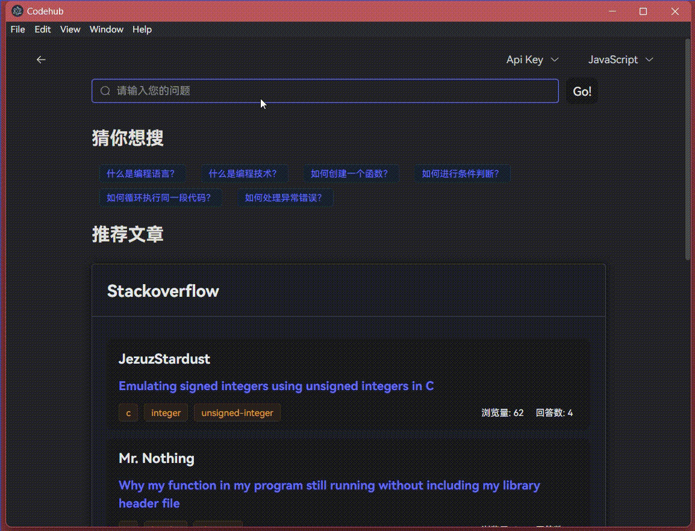

# Codehub

一个集成了**Ai**,**Web search**,**github**,**wikipedia**,**stackoverflow**多方面资源的代码搜索工具，使用`electron`+`vue`+`vite`编写。

## 开发编译

```bash
# clone the project
git clone https://github.com/luxingzhi27/code-search-tool.git

# enter the project directory
cd code-search-tool

# install dependency
pnpm i

# develop
pnpm dev

# build
pnpm build
```

build后在`release`文件夹下会生成对应平台的安装包。

## 展示


